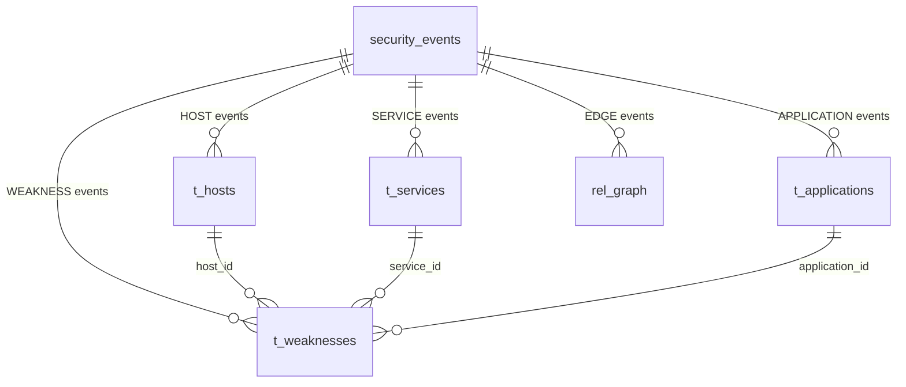

# h3-weakness

A small Dataform and BigQuery demo. It models an event-sourced security topology: hosts, services and applications, the weaknesses (CVEs) that affect them, and how they connect.

Everything is derived from a single append-only event log. The tables show the **current state**, rebuilt from the events on every run.

## Data model



| Table             | Key                         | Description                                                   |
| ----------------- | --------------------------- | ------------------------------------------------------------- |
| `security_events` | `event_id`                  | Append-only event log (source)                                |
| `t_hosts`         | `entity_id`                 | Latest state per host; deleted hosts removed                  |
| `t_services`      | `entity_id`                 | Latest state per service                                      |
| `t_applications`  | `entity_id`                 | Latest state per application                                  |
| `t_weaknesses`    | `weakness_id`               | Latest state per CVE finding; remediated ones removed         |
| `rel_graph`       | `source_type` + `source_id` | Active edges, one row per source, targets in a repeated field |

### Relationships

- **Host, service or application → weaknesses (one-to-many).** Each weakness targets exactly one entity, via one of `host_id`, `service_id` or `application_id`. This is an _exclusive arc_, enforced by the `assert_weakness` assertion.
- **Host ↔ service and service ↔ application (many-to-many).** `rel_graph` is the junction. Edges are polymorphic, so the target table depends on the type column.
- BigQuery does not enforce foreign keys, so integrity is checked with Dataform assertions.

## How it works

1. `security_events` holds every event: `HOST_DISCOVERED`, `HOST_DELETED`, `WEAKNESS_FOUND`, `WEAKNESS_REMEDIATED`, `EDGE_LINKED`, `EDGE_UNLINKED` and so on, with a JSON `payload`.
2. Each `t_*` table keeps the latest event per entity (`QUALIFY ROW_NUMBER() ... = 1`) and drops entities whose latest event is a delete or remediation.
3. `rel_graph` keeps the latest event per edge and aggregates the linked targets for each source.
4. Views in `definitions/views/` contain some sample queries.

## Running the demo

1. **Seed the data.** Run the action tagged `seed` (`definitions/seed_security_events.sqlx`). It deploys the procedure `sp_seed_security_events` and loads 23 demo events. Re-running it resets the data.
2. **Build the tables.** Run `t_hosts`, `t_services`, `t_applications`, `t_weaknesses` and `rel_graph`, with their assertions and `assert_weakness`.
3. **Build the views** and query them
   - v_open_weaknesses: "Open weaknesses by severity, with the name of whatever they target"
   - v_topology_edges: "Active edges flattened to one row per link: the junction table behind the many-to-many relationships"
   - v_blast_radius: "Host to service to application chains, so you can see what a vulnerable host exposes"

Don't include the `seed` tag in normal runs, because it resets `security_events`.

### Make the assertion fail on purpose

In BigQuery, add a weakness with no valid target, then re-run the workflow:

```sql
CALL `fluent-horizon-196715.dataform.sp_seed_security_events`(TRUE, TRUE);
```

`assert_weakness` will report the offending row. Call it with `(TRUE, FALSE)` to go back to clean data.

### What to expect from the seed data

- `t_hosts`: 2 rows. `h-3` was deleted, and `h-1` shows its updated IP.
- `t_weaknesses`: 4 rows. `w-4` was remediated and `w-1` was raised to severity 10.
- `rel_graph`: `h-1` is linked only to `s-1`, because `s-3` was unlinked.

## Project layout

| Path                                    | Purpose                                               |
| --------------------------------------- | ----------------------------------------------------- |
| `definitions/source-declarations.js`    | Declares `security_events`                            |
| `definitions/seed_security_events.sqlx` | Seed procedure and its call (tag `seed`)              |
| `definitions/tables/entities.js`        | Host, service and application tables from one factory |
| `definitions/tables/t_weakness.js`      | `t_weaknesses` and its exclusive-arc assertion        |
| `definitions/tables/rel_graph.js`       | `rel_graph`                                           |
| `definitions/views/`                    | Demo views                                            |
| `includes/helpers.js`                   | Table factory and assertion helper                    |

Project: `fluent-horizon-196715`, dataset `dataform`.
